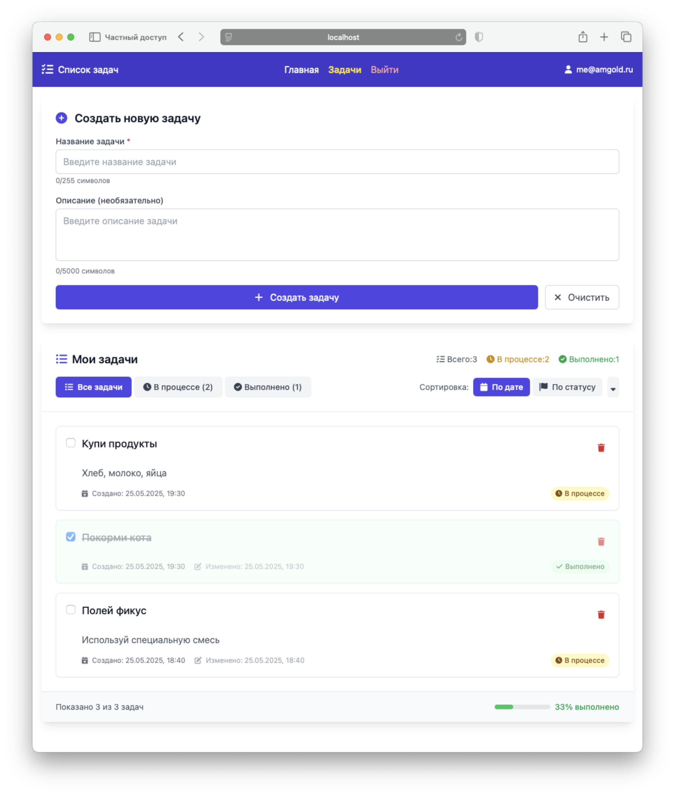

# Веб-приложение "Список задач"

Простое веб-приложение “Список задач” с возможностью регистрации, аутентификации и управления задачами.

## Реализованные возможности

- Backend (API):
  - Функции: регистрация, аутентификация (JWT-токен), CRUD-операции для задач.
  - Данные задачи: заголовок, описание, статус (выполнено/не выполнено), дата создания и изменения.
  - Валидация данных и обработка ошибок.
  - Хеширование паролей с использованием `bcrypt`
  - Проверка прав доступа (пользователи видят только свои задачи)
  - Асинхронная архитектура с `asyncpg`  и SQLAlchemy 2.0
  - Покрытие тестами (pytest, включая интеграционные тесты)
  - Система миграций базы данных через Alembic
  - Healthcheck эндпоинт для мониторинга uptime
  - Настроен эндпоинт для сбора метрик Prometheus.
  - Настроено логирование при помощи сервиса Logfire.

- Frontend:

  - Функционал: форма регистрации и логина, добавление задач, их редактирование, удаление, фильтрация по статусу.
  - Возможность сортировки задач по дате создания и статусу.
  - Реализована анимация при добавлении и удаления задач.
  - Обработка ошибок от API и отображение сообщений для пользователя.
  - Адаптивный дизайн для мобильных устройств
  - Inline редактирование задач (клик по тексту для редактирования)
  - Сохранение состояния аутентификации в localStorage
  - Автоматические редиректы для неаутентифицированных пользователей
  - Валидация форм на стороне клиента
  - Responsive интерфейс с иконками Font Awesome
  - Состояния загрузки и обработка ошибок сети



## Используемые технологии

### Backend
- **FastAPI** - веб-фреймворк
- **SQLAlchemy 2** - ORM
- **Alembic** - управление миграциями
- **PostgreSQL** - база данных
- **asyncpg** - асинхронное подключение к Postgres
- **pytest**, **pytest-asyncio** - тестирование

### Frontend
- **Vue 3** - фреймворк
- **TypeScript** - типизация
- **Vite** - сборщик
- **Vue Router** - маршрутизация
- **Pinia** - управление состоянием
- **Tailwind CSS** - стили
- **Font Awesome** - иконки

### Инфраструктура
- **Docker Compose** - контейнеризация
- [just](https://just.systems/man/en/) - управление проектом
- `uv` - управление зависимостями бэкенда
- **Nginx** - веб-сервер - пока не настроен, предполагается его использование для запуска в production


## Запуск проекта

Для управления проектом используется инструмент [just](https://just.systems/man/en/). Необходимо его [установить](https://just.systems/man/en/packages.html), чтобы не выполнять команды из [Justfile](./Justfile) вручную.

### Локальный запуск для разработки

- Клонировать репозиторий 

```bash
git clone https://github.com/hazadus/fastapi-todos
cd fastapi-todos
```

- Создать файлы с настройками бэкенда и фронтенда

```bash
cp backend/.env.example backend/.env.dev
cp frontend/.env.example frontend/.env.dev
```

- Запустить проект в Docker

```bash
just dev
# или `docker compose --profile dev up`
```

- Применить миграции к БД (см. ниже)

- После запуска будут доступны:
   - Фронтенд на http://localhost:3000/
   - Бэкенда на http://localhost:8000/

#### Создание и применение миграций

```bash
# Запустить приложение в Докере
just dev
# Параллельно выполнить команду:
docker exec app-dev alembic revision --message="Add_some_new_table" --autogenerate
# Для применения миграций:
docker exec app-dev alembic upgrade head
```

#### Тесты бэкенда

1. Тесты запускаются в Докере при помощи команды `just test`. При этом, каждый раз создаётся чистая база данных для интеграционных тестов.
2. Файл настроек приложения для тестов `./backend/.env.test` редактировать не требуется.


#### Переменные окружения

##### Backend (файл `backend/.env.dev`)

- `APP_VERSION` - версия приложения
- `AUTH_SECRET_KEY` - секретный ключ для подписи JWT токенов (должен быть изменён в production)
- `POSTGRES_USER` - имя пользователя PostgreSQL
- `POSTGRES_PASSWORD` - пароль пользователя PostgreSQL  
- `POSTGRES_DB` - название базы данных PostgreSQL
- `POSTGRES_HOST` - хост базы данных
- `POSTGRES_PORT` - порт базы данных PostgreSQL 
- `LOGFIRE_TOKEN` - токен для сервиса логирования Logfire (опционально)

##### Frontend (файл `frontend/.env.dev`)

- `VITE_API_BASE_URL` - базовый URL для API бэкенда (например, `http://localhost:8000`)
